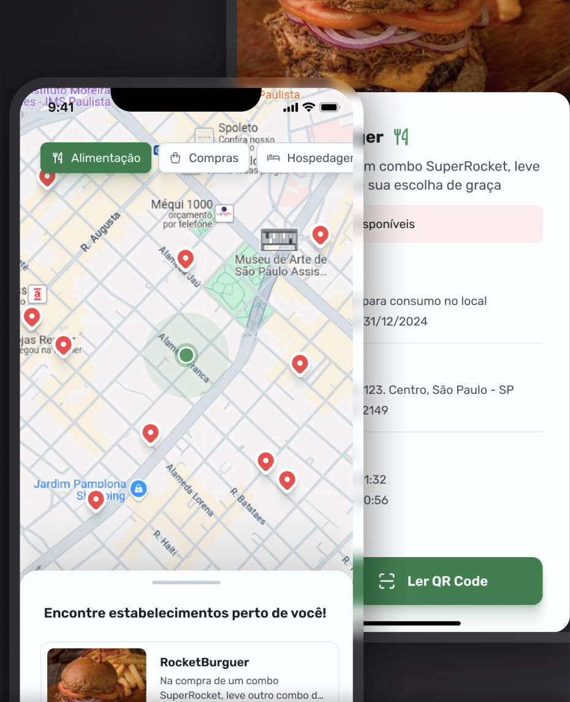
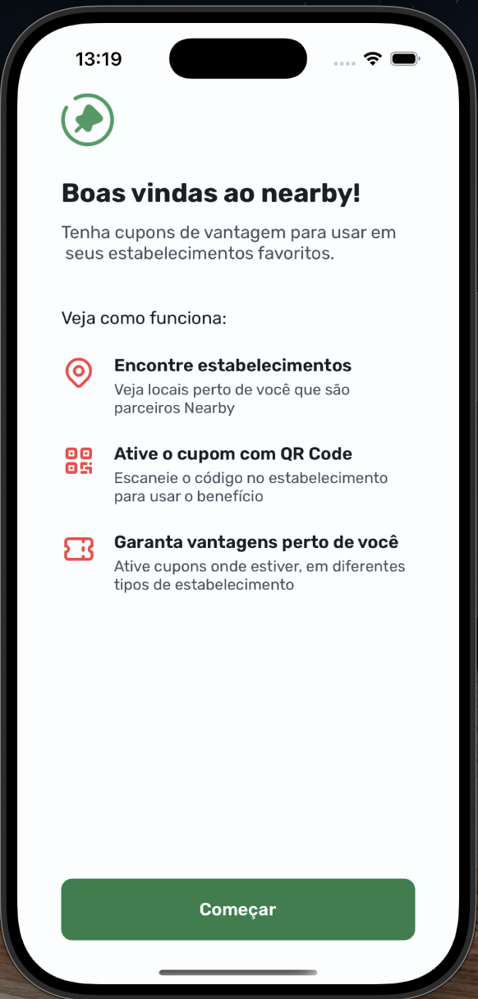
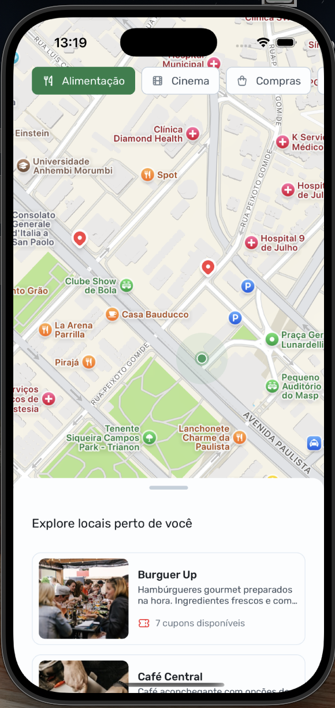
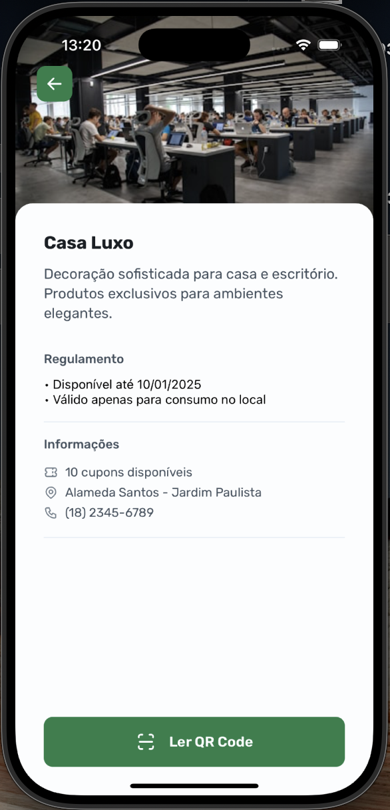

# Nearby

Nearby is a React Native mobile application that helps users find nearby places offering available coupons. Users can explore a map with locations, check the number of remaining coupons, and redeem them by scanning a QR code.



## Features

- **MapView Integration**: Displays the user's current location and nearby places with available coupons.
- **Place Details**: Click on a location to view coupon availability.
- **QR Code Scanner**: Scan a place's QR code to fetch and redeem an available coupon.
- **API Integration**: Fetches coupon details based on the scanned QR code.




## Installation

1. Clone the repository:
   ```sh
   git clone https://github.com/yourusername/nearby.git
   cd nearby
   ```
2. Install dependencies:
   ```sh
   npm install
   # or
   yarn install
   ```
3. Run the application:
   ```sh
   npx expo start
   ```



## Dependencies

This project uses the following main libraries:

- `react-native-maps` – Displays the map with user and place locations.
- `react-native-camera` – Enables QR code scanning.
- `react-navigation` – Handles app navigation.
- `axios` – Fetches data from the API.

## Usage

1. Open the app and allow location access.
2. Browse nearby places on the map.
3. Tap a location to see available coupons.
4. Click "Read QR Code" to scan the QR code at the place.
5. If a coupon is available, it will be displayed for redemption.

## API Integration

The app fetches coupon details by sending the scanned place ID to an API endpoint:
```sh
GET /api/coupons/:placeId
```

The API returns an available coupon code for the user.
